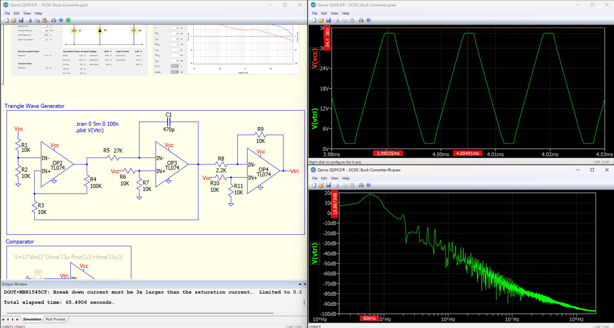
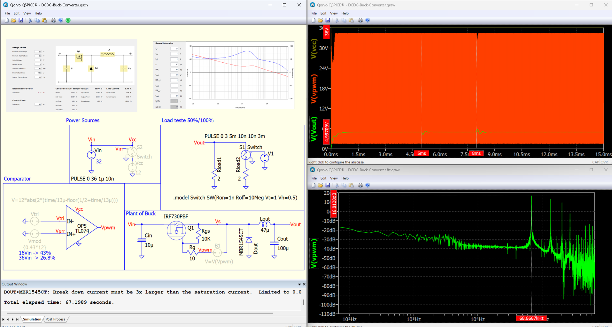
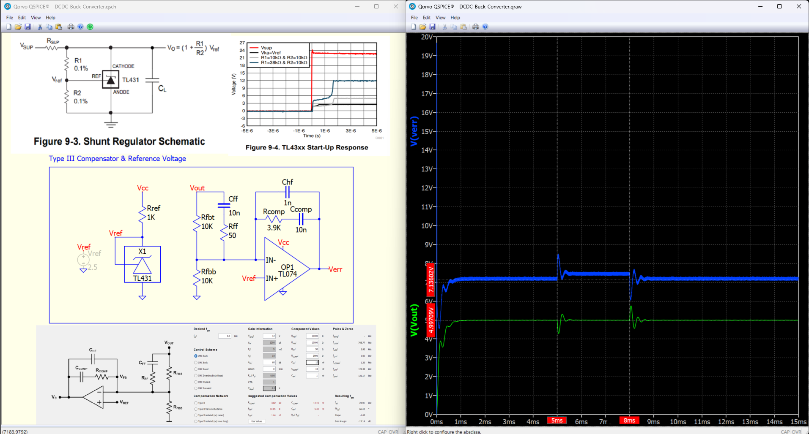
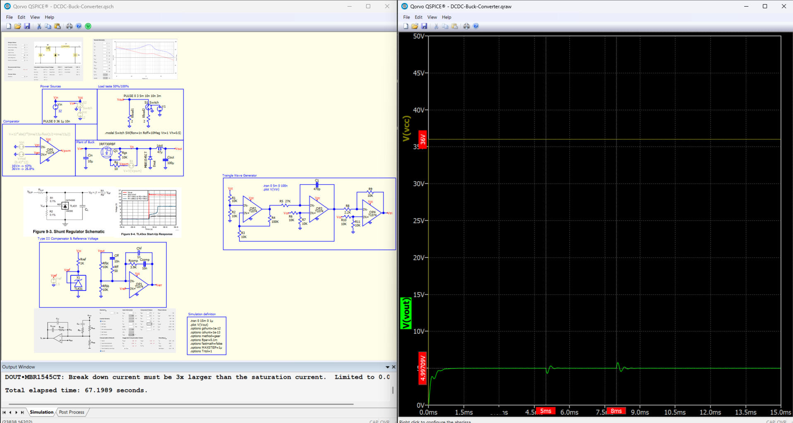
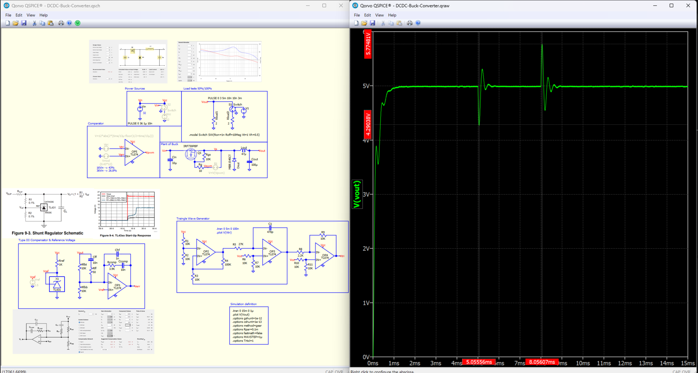

# DCDC-Buck-Converter
Qspice simulation of a DC-DC Buck Converter using analog eletronics.

## Triangle Wave Oscilattor

Frequency in 60kHz. Capacitor C1 and R5 sets the frequency. Last stage is only for amplificate. 

## PWM Comparator Signal and Buck Plant

From Power Stage Designer (Texas Instruments), using TL074 as comparator with 36Vcc voltage suppy.

## Compensator Type III

From Power Stage Designer (Texas Instruments), using TL074 as compensator and TL431 as voltage reference.

## Complete Circuit

Overshoot of 0.77V (15.4% of 5V), undershoot of 0.71V (11.8% of 5V), and 1ms for stabilization of step load response (2.5A@0ms->5A@5ms->2.5A@8ms). 36V source is a PULSE source that starts in 1us. The circuit takes 1ms to get 5V converted on Vout.

